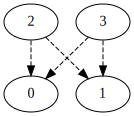
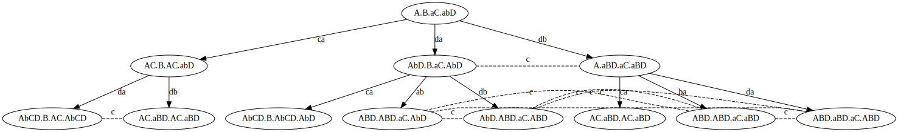

# GoMoChe - Gossip Model Checking

<<<<<<< HEAD

A Haskell tool to analyse (dynamic) gossip protocols, including an epistemic model checker.

## Getting Started

Option A: For a quick try-out, [click here to use GoMoChe in your browser via GitPod](https://gitpod.io/#https://github.com/m4lvin/GoMoChe), *wait* and use the terminal there.

Option B: To use GoMoChe locally, you need the [Haskell Tool Stack](https://haskellstack.org). Then do `stack build` and `stack ghci` inside this folder.

## Usage Examples

List all call sequences permitted by the protocol `lns` on the graph `threeExample` defined in the module `Gossip.Examples`:

    GoMoChe> mapM_ print $ sequences lns (threeExample,[])
    [(0,1),(0,2),(1,2)]
    [(0,1),(1,2),(0,2)]
    [(0,1),(2,1),(0,2)]
    [(1,2),(0,1)]
    [(2,1),(0,1)]

Count how many of these call sequences are successful and unsuccessful:

    GoMoChe> statistics lns (threeExample,[])
    (3,2)

The same, for another gossip graph given in short notation:

    GoMoChe> statistics lns (parseGraph "01-12-231-3 I4",[])
    (57,20)

Evaluate a formula at a gossip state:

    GoMoChe> eval (threeExample,[(0,1)]) (S 1 0)
    True
    GoMoChe> eval (threeExample,[(0,1)]) (S 1 2)
    False
    GoMoChe> eval (threeExample,[(0,1)]) (K 2 anyCall (S 1 0))
    True
    GoMoChe> eval (threeExample,[(0,1)]) (K 2 lns (S 1 0))
    True
    GoMoChe> eval (threeExample,[(0,1),(1,2)]) (S 0 2)
    False
    GoMoChe> eval (threeExample,[(0,1),(1,2)]) (S 2 0)
    True

If you have graphviz installed, you can visualize gossip graphs like this:

    GoMoChe> dispDot $ diamondExample

Also execution trees can be visualized, for example:

    GoMoChe> dispTreeWith [2] 2 1 lns (tree lns (nExample,[]))

Note: In GitPod, use `pdf` and `pdfTreeWith` instead of `dispDot` and `dispTreeWidth`.

## Tests

The file `test/results.hs` contains a test suite that also covers most examples.
You can run it with `stack clean; stack test --coverage`.

## References

- Hans van Ditmarsch, Malvin Gattinger, Louwe B. Kuijer, Pere Pardo:
  [Strengthening Gossip Protocols using Protocol-Dependent Knowledge](https://malv.in/2019/StrengtheningGossipProtocols.pdf)
  In: Journal of Applied Logics - IfCoLog Journal of Logics and their Applications, Volume 6, Number 1, 2019.

- Chapter 6 "Dynamic Gossip"
  in Malvin Gattinger: [New Directions in Model Checking Dynamic Epistemic Logic](https://malv.in/phdthesis)
  PhD thesis at ILLC, University of Amsterdam, 2018.

- Hans van Ditmarsch, Jan van Eijck, Pere Pardo, Rahim Ramezanian, François Schwarzentruber:
  *Dynamic Gossip*.
  In: Bulletin of the Iranian Mathematical Society (BIMS), 2018.
  https://doi.org/10.1007/s41980-018-0160-4

- Hans van Ditmarsch, Jan van Eijck, Pere Pardo, Rahim Ramezanian, François Schwarzentruber:
  *Epistemic protocols for dynamic gossip*.
  In: Journal of Applied Logic, Volume 20, 2017, Pages 1-31,
  https://doi.org/10.1016/j.jal.2016.12.001
=======
A Haskell tool to analyse (dynamic) gossip protocols, including an epistemic model checker.
>>>>>>> 29d4d6a (update README, clean up and small fixes)

## Other Tools

<<<<<<< HEAD
=======
You should have the [Haskell Tool Stack](https://haskellstack.org) installed.

    git clone https://github.com/m4lvin/GoMoChe.git
    cd GoMoChe
    stack build
    stack ghci

## Usage Examples

List all call sequences permitted by the protocol `lns` on the graph `threeExample` defined in the module `Gossip.Examples`:

    λ> mapM_ print $ sequences lns (threeExample,[])
    [(0,1),(0,2),(1,2)]
    [(0,1),(1,2),(0,2)]
    [(0,1),(2,1),(0,2)]
    [(1,2),(0,1)]
    [(2,1),(0,1)]

Count how many of these call sequences are successful and unsuccessful:

    λ> statistics lns (threeExample,[])
    (3,2)

The same, for another gossip graph given in short notation:

    λ> statistics lns (parseGraph "01-12-231-3 I4",[])
    (57,20)

Evaluate a formula at a gossip state:

    λ> eval (threeExample,[(0,1)]) (S 1 0)
    True
    λ> eval (threeExample,[(0,1)]) (S 1 2)
    False
    λ> eval (threeExample,[(0,1)]) (K 2 anyCall (S 1 0))
    True
    λ> eval (threeExample,[(0,1)]) (K 2 lns (S 1 0))
    True
    λ> eval (threeExample,[(0,1),(1,2)]) (S 0 2)
    False
    λ> eval (threeExample,[(0,1),(1,2)]) (S 2 0)
    True

If you have graphviz installed, you can visualize gossip graphs like this:

    λ> dispDot $ diamondExample

## Tests

The file `test/results.hs` contains a test suite that also covers most examples.
You can run it with `stack clean; stack test --coverage`.

## Related references:

- Hans van Ditmarsch, Malvin Gattinger, Louwe B. Kuijer, Pere Pardo:
  [Strengthening Gossip Protocols using Protocol-Dependent Knowledge](https://malv.in/2019/StrengtheningGossipProtocols.pdf)
  In: Journal of Applied Logics - IfCoLog Journal of Logics and their Applications, Volume 6, Number 1, 2019.

- Chapter 6 "Dynamic Gossip"
  in Malvin Gattinger: [New Directions in Model Checking Dynamic Epistemic Logic](https://malv.in/phdthesis)
  PhD thesis at ILLC, University of Amsterdam, 2018.

- Hans van Ditmarsch, Jan van Eijck, Pere Pardo, Rahim Ramezanian, François Schwarzentruber:
  *Dynamic Gossip*.
  In: Bulletin of the Iranian Mathematical Society (BIMS), 2018.
  https://doi.org/10.1007/s41980-018-0160-4

- Hans van Ditmarsch, Jan van Eijck, Pere Pardo, Rahim Ramezanian, François Schwarzentruber:
  *Epistemic protocols for dynamic gossip*.
  In: Journal of Applied Logic, Volume 20, 2017, Pages 1-31,
  https://doi.org/10.1016/j.jal.2016.12.001

## Other Tools

>>>>>>> 29d4d6a (update README, clean up and small fixes)
- *ElmGossip: Explore dynamic gossip in your browser* by Ramon Meffert
  <https://github.com/RamonMeffert/elm-gossip>
